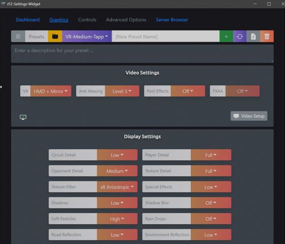

# rF2 Settings Wizard
### rFactor 2 Settings application

M$ Windows application that will let you create presets/profiles of your rFactor 2 settings and directly connect to rFactor 2 multiplayer sessions.
Quickly change between eg. a performance focused VR setup or
an eye-candy favoured Replay setup.

    

#### Usage
- Download the <a href="https://github.com/tappi287/rf2_video_settings/releases">latest installer</a> and start the app
- Enter a name for a new Preset and hit the [ + ] button
- adjust the settings to your liking, they will be automatically saved and applied to your rFactor installation whenever
you change a setting

##### Preset import/export
Presets will be saved to your MyDocuments dir and can be shared. Drop preset files onto
the app window to import those presets.
    
The app will start in a browser window.

#### Requirements
 - M$ Windows >= 7 (only tested on 10)
 - modern Web Browser
 - rFactor 2 Steam installation
