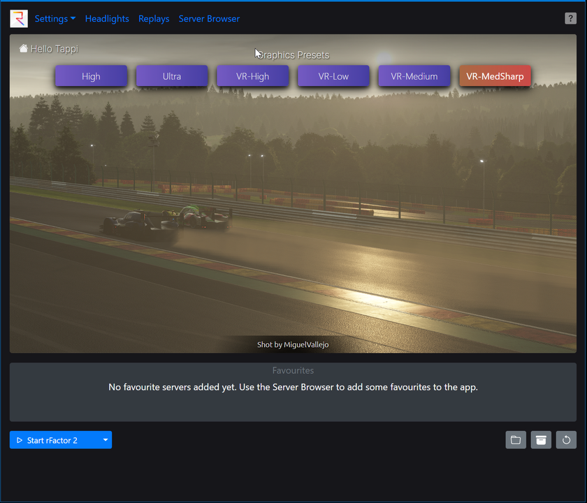

# rF2 Settings Widget

M$ Windows application that will let you create presets/profiles of your rFactor 2 settings and directly connect to rFactor 2 multiplayer sessions.
Quickly change between e.g., a performance focused VR setup, or
an eye-candy favoured Replay setup.

    

### Usage
- Download the <a href="https://github.com/tappi287/rf2_video_settings/releases">latest installer</a> and start the app
- Choose a preset or click "Graphics Presets", hit the [ + ] button and create a new one
- adjust the settings to your liking, they will be automatically saved and applied to your rFactor installation whenever
you change a setting
- or follow this [YouTube tutorial](https://www.youtube.com/watch?v=32qu10zA28A) courtesy of [Jaytona Virtual Racing](https://www.youtube.com/channel/UCjBDoCHuwXzntUpNk5ji5iw)

## Features
##### Preset import/export
Presets will be saved to your MyDocuments dir and can be shared. Drop preset files onto
the app window to import those presets.
    
##### player.json import
Drop a player.json onto the app window to import the graphics settings.

##### Manage video resolution/refresh rate settings
Graphics Presets can save your video resolution/window mode/VR/Non-VR settings
if you configure them from inside the app.

##### Replay Manager
Browse through your replay library, sort, filter by race/qualy etc.
and batch delete or watch replays.
Choose a replay specific Graphics Preset if you start 
the replay from within the app.

##### Server favourites
Server favourites set in the app will be instantly displayed on the dashboard
and can be joined directly from within the app.

##### Headlights
Easily manage the builtin <a href="https://github.com/TonyWhitley/rF2headlights">rf2 headlights<a/> 
functionality. Assign flashing headlights to any controller button and automatically start with 
headlights enabled and/or pit lane or speed limiter auto-flash.

##### Advanced Settings
Adjust settings not available in the game UI without hacking through json files. 

### Requirements
 - M$ Windows >= 7 (only tested on 10)
 - modern Web Browser (will start with Chrome, fallback to Chromium Edge, fallback to system default web browser)
 - rFactor 2 Steam installation

## Development Setup
If you'd like to contribute to development, these steps may help you to get up and running:
 - clone this repo `git clone https://github.com/tappi287/rf2_video_settings`
 - install [Node Package Manager](https://nodejs.org/en/download/) `npm`
 - change to front-end dir `cd vue` and install node modules `npm install`

 - make sure you have a Python 3.10.x interpreter on your system [python.org/downloads](https://www.python.org/downloads/)
 - install pipenv `python -m pip install pipenv`
 - create python virtual env `pipenv install --dev`

#### Usage
 - in the project root dir *rf2_video_settings* switch into the Python virtual env by `pipenv shell`
 - start the app with `python.exe app.py`
 - build an executable/installer with `python.exe build.py`

  ##### Dev Requirements
 - Python 3.10.x
   - pipenv >= 2022.3.23
 - npm >= 8.3.1
 - Chromium based web browser (Edge, Opera, Chrome) for running in browser app-mode